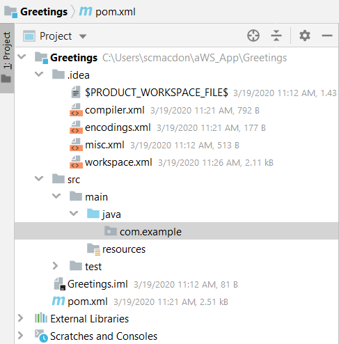

# Submitting data to an Amazon DynamoDB table using the Enhanced Client within a Spring Boot application 

You can develop a fully functioning data submission application by using AWS Services (Amazon DynamoDB and AWS Elastic Beanstalk) and Spring Boot. This application uses the DynamoDB Enhanced Client (**software.amazon.awssdk.enhanced.dynamodb.DynamoDbEnhancedClient**)  to submit data to a DynamoDB table. This application also uses Spring Boot APIs to build a model, views and a controller. 

The DynamoDB Enhanced client lets you map your client-side classes to Amazon DynamoDB tables. To use DynamoDB Enhanced Client, you define the relationship between items in a DynamoDB table and their corresponding object instances in your code. The DynamoDB Enhanced Client class enables you to access your tables; perform various create, read, update, and delete (CRUD) operations; and execute queries.

**Note**: For more information about the DynamoDB Enhanced client, see <X-REF TO Java 2 DEV Guide>. 

The following illustration shows the application that is developed by following this document.

WHen the **Submit** button is clicked, the data is submitted to a Spring Controller and persisted into a DynamoDB table named **Greeting**. The following illustration shows this table. 

This development document guides you through creating an AWS application that uses Spring Boot. Once the application is developed, this document teaches you how to deploy it to the AWS Elastic Beanstalk.

To follow along with the document, you require the following:

+ An AWS Account.
+ A Java IDE (for this example, IntelliJ is used).
+ Java 1.8 SDK and Maven.

The following illustration shows the project that is created.

**Cost to Complete**: The AWS Services included in this document are included in the AWS Free Tier.

**Note**: Please be sure to terminate all of the resources created during this document to ensure that you are no longer charged.

This document contains the following sections: 

+ Create an IntelliJ project named **Greetings**
+ Add the Spring POM dependencies to your project	
+ Setup the Java packages in your project
+ Create the Java logic for the main Boot class
+ Create the main controller class
+ Create the Greeting class
+ Create the Service class
+ Create the HTML files
+ Create a JAR file for the **Greetings** application 
+ Setup the DynamoDB table 
+ Deploy the  **Greetings** application to the AWS Elastic Beanstalk

## Create an IntelliJ project named Greetings

**Create a new IntelliJ project named Greetings**

1. From within the IntelliJ IDE, click **File**, **New**, **Project**. 
2. In the **New Project** dialog, select **Maven**. 
3. Click **Next**.
4. In the **GroupId** field, enter **spring-aws**. 
5. In the **ArtifactId** field, enter **Greetings**. 
6. Click **Next**.
7. Click **Finish**. 

## Add the Spring POM dependencies to your project

At this point, you have a new project named **Greetings**, as shown in this illustration. 

Inside the **project** element in the **pom.xml** file, add the **spring-boot-starter-parent** dependency:
  
     <parent>
		  <groupId>org.springframework.boot</groupId>
		  <artifactId>spring-boot-starter-parent</artifactId>
		  <version>2.2.5.RELEASE</version>
		  <relativePath/> <!-- lookup parent from repository -->
	  </parent>
    
Also, add the following Spring Boot **dependency** elements inside the **dependencies** element.

    <dependency>
			<groupId>org.springframework.boot</groupId>
			<artifactId>spring-boot-starter-thymeleaf</artifactId>
		</dependency>
		<dependency>
			<groupId>org.springframework.boot</groupId>
			<artifactId>spring-boot-starter-web</artifactId>
		</dependency>
		 <dependency>
			<groupId>org.springframework.boot</groupId>
			<artifactId>spring-boot-starter-test</artifactId>
			<scope>test</scope>
			<exclusions>
				<exclusion>
					<groupId>org.junit.vintage</groupId>
					<artifactId>junit-vintage-engine</artifactId>
				</exclusion>
			</exclusions>
		  </dependency>
      
In addition, you need to add these DynamoDB API dependencies. 

    <dependencyManagement>
	    	<dependencies>
			  <dependency>
				  <groupId>software.amazon.awssdk</groupId>
				  <artifactId>bom</artifactId>
				  <version>2.10.54</version>
				  <type>pom</type>
				<scope>import</scope>
			</dependency>
		  </dependencies>
	  </dependencyManagement>
    
    <dependency>
			<groupId>software.amazon.awssdk</groupId>
			<artifactId>dynamodb-enhanced</artifactId>
			<version>2.10.84-PREVIEW</version>
		</dependency>
		<dependency>
			<groupId>software.amazon.awssdk</groupId>
			<artifactId>dynamodb</artifactId>
			<version>2.5.10</version>
		</dependency>
    
**Note** - Ensure that you are using Java 1.8 (shown below).
  
At this point, the **pom.xml** file resembles the following file. 

    <?xml version="1.0" encoding="UTF-8"?>
    <project xmlns="http://maven.apache.org/POM/4.0.0"
         xmlns:xsi="http://www.w3.org/2001/XMLSchema-instance"
         xsi:schemaLocation="http://maven.apache.org/POM/4.0.0 http://maven.apache.org/xsd/maven-4.0.0.xsd">
    <modelVersion>4.0.0</modelVersion>
    <groupId>spring-aws</groupId>
    <artifactId>Greetings</artifactId>
    <version>1.0-SNAPSHOT</version>
    <parent>
        <groupId>org.springframework.boot</groupId>
        <artifactId>spring-boot-starter-parent</artifactId>
        <version>2.2.5.RELEASE</version>
        <relativePath/> <!-- lookup parent from repository -->
    </parent>

    <properties>
        <java.version>1.8</java.version>
    </properties>
    <dependencyManagement>
        <dependencies>
            <dependency>
                <groupId>software.amazon.awssdk</groupId>
                <artifactId>bom</artifactId>
                <version>2.10.54</version>
                <type>pom</type>
                <scope>import</scope>
            </dependency>
        </dependencies>
    </dependencyManagement>
    <dependencies>
        <dependency>
            <groupId>org.springframework.boot</groupId>
            <artifactId>spring-boot-starter-thymeleaf</artifactId>
        </dependency>
        <dependency>
            <groupId>org.springframework.boot</groupId>
            <artifactId>spring-boot-starter-web</artifactId>
        </dependency>
        <dependency>
            <groupId>org.springframework.boot</groupId>
            <artifactId>spring-boot-starter-test</artifactId>
            <scope>test</scope>
            <exclusions>
                <exclusion>
                    <groupId>org.junit.vintage</groupId>
                    <artifactId>junit-vintage-engine</artifactId>
                </exclusion>
            </exclusions>
        </dependency>
        <dependency>
            <groupId>software.amazon.awssdk</groupId>
            <artifactId>dynamodb-enhanced</artifactId>
            <version>2.10.84-PREVIEW</version>
        </dependency>
        <dependency>
            <groupId>software.amazon.awssdk</groupId>
            <artifactId>dynamodb</artifactId>
            <version>2.5.10</version>
        </dependency>
      </dependencies>
      <build>
        <plugins>
            <plugin>
                <groupId>org.springframework.boot</groupId>
                <artifactId>spring-boot-maven-plugin</artifactId>
            </plugin>
        </plugins>
      </build>
    </project>
    
## Setup the Java packages in your project

Create a Java package in the **main/java** folder named **com.example**. 

The Java files go into these subpackages:

The following list describes these packages:

+ **entities** - contains Java files that represent the model. In this example, the model class is named **WorkItem**. 
+ **jdbc** - contains Java files that use the JDBC API to interact with the RDS database.
+ **services** - contains Java files that invoke AWS Services. For example, the  **com.amazonaws.services.simpleemail.AmazonSimpleEmailService** is used within a Java file to send email messages.
+ **securingweb** - contains all of the Java files required for Spring Security. 
